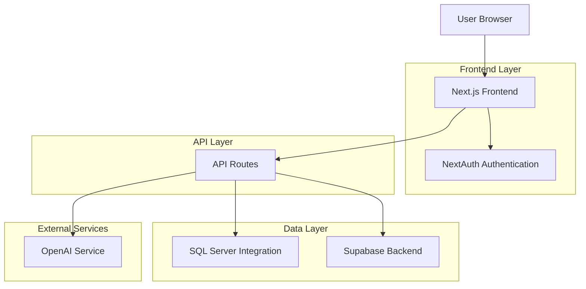
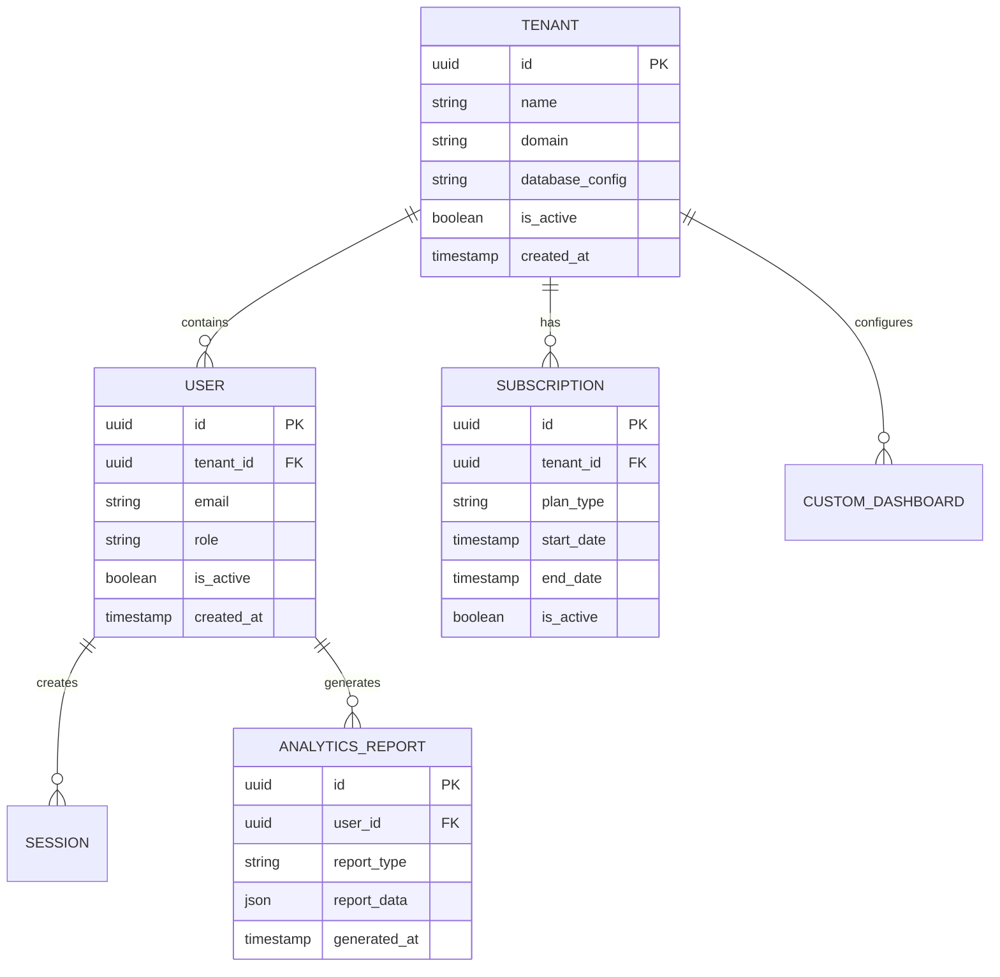
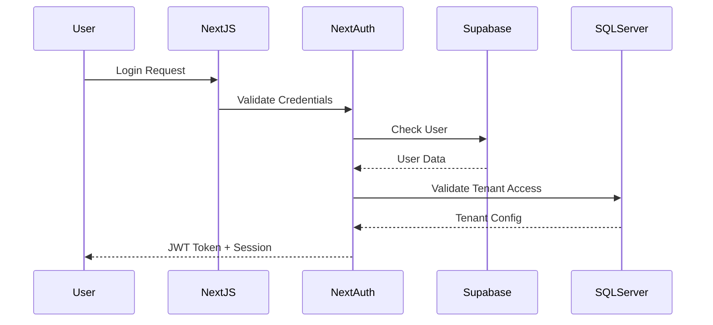

# Arquitetura Técnica - Cepalab SaaS

## 1. Visão Geral da Arquitetura

O Cepalab é um sistema ERP/SGC (Sistema de Gestão Laboratorial) construído como uma aplicação SaaS multi-tenant, utilizando Next.js como framework principal. A arquitetura segue um padrão de camadas com separação clara entre frontend, backend e integrações externas.

### 1.1 Diagrama de Arquitetura



## 2. Stack Tecnológica

### 2.1 Frontend
- **Framework**: Next.js 14 (App Router)
- **Linguagem**: TypeScript
- **Estilização**: Tailwind CSS 3.x
- **Componentes UI**: Shadcn/UI + Radix UI
- **Gráficos**: Recharts
- **Estado**: React Context + SWR
- **Validação**: Zod

### 2.2 Backend & Integrações
- **Autenticação**: NextAuth.js
- **Banco de Dados**: SQL Server (existente) + Supabase (PostgreSQL)
- **IA/Analytics**: OpenAI GPT API
- **ORM**: Prisma (para Supabase)
- **Query Builder**: mssql (para SQL Server)

### 2.3 DevOps & Ferramentas
- **Versionamento**: Git
- **Linting**: ESLint + Prettier
- **Build**: Vercel/Node.js
- **Monitoramento**: Vercel Analytics

## 3. Estrutura de Pastas

```
cepalab/
├── app/                    # Rotas Next.js App Router
│   ├── (auth)/            # Rotas de autenticação
│   ├── (dashboard)/     # Dashboard principal
│   ├── api/               # API Routes
│   │   ├── auth/          # Endpoints de autenticação
│   │   ├── analytics/     # Análises e relatórios
│   │   ├── integrations/  # Integrações externas
│   │   └── webhooks/      # Webhooks
│   └── (saas)/            # Funcionalidades SaaS
├── components/            # Componentes React
│   ├── ui/               # Componentes UI (shadcn)
│   ├── dashboard/        # Componentes específicos do dashboard
│   ├── charts/           # Componentes de gráficos
│   └── saas/             # Componentes SaaS
├── lib/                   # Utilitários e configurações
│   ├── auth.ts           # Configuração NextAuth
│   ├── database.ts       # Conexões SQL Server/Supabase
│   ├── openai.ts         # Integração OpenAI
│   └── utils.ts          # Funções utilitárias
├── prisma/               # Schema do Supabase
├── hooks/                # Custom React Hooks
├── types/                # Definições TypeScript
└── middleware.ts         # Middleware Next.js
```

## 4. Modelo de Dados

### 4.1 SQL Server (Dados Laboratoriais)

Views existentes utilizadas:
- `v_venda`: Vendas e faturamento
- `v_estoque`: Controle de estoque
- `v_situacao_caixa`: Situação do caixa
- `v_conta_receber`: Contas a receber

### 4.2 Supabase (Dados SaaS)



### 4.3 DDL Supabase

```sql
-- Tabela de tenants (multi-tenant)
CREATE TABLE tenants (
    id UUID PRIMARY KEY DEFAULT gen_random_uuid(),
    name VARCHAR(255) NOT NULL,
    domain VARCHAR(255) UNIQUE,
    database_config JSONB,
    is_active BOOLEAN DEFAULT true,
    created_at TIMESTAMP WITH TIME ZONE DEFAULT NOW()
);

-- Tabela de usuários
CREATE TABLE users (
    id UUID PRIMARY KEY DEFAULT gen_random_uuid(),
    tenant_id UUID REFERENCES tenants(id),
    email VARCHAR(255) UNIQUE NOT NULL,
    name VARCHAR(255) NOT NULL,
    role VARCHAR(50) DEFAULT 'user',
    is_active BOOLEAN DEFAULT true,
    created_at TIMESTAMP WITH TIME ZONE DEFAULT NOW()
);

-- Tabela de assinaturas
CREATE TABLE subscriptions (
    id UUID PRIMARY KEY DEFAULT gen_random_uuid(),
    tenant_id UUID REFERENCES tenants(id),
    plan_type VARCHAR(50) NOT NULL,
    start_date TIMESTAMP WITH TIME ZONE DEFAULT NOW(),
    end_date TIMESTAMP WITH TIME ZONE,
    is_active BOOLEAN DEFAULT true
);

-- Tabela de relatórios de analytics
CREATE TABLE analytics_reports (
    id UUID PRIMARY KEY DEFAULT gen_random_uuid(),
    user_id UUID REFERENCES users(id),
    tenant_id UUID REFERENCES tenants(id),
    report_type VARCHAR(100) NOT NULL,
    report_data JSONB,
    generated_at TIMESTAMP WITH TIME ZONE DEFAULT NOW()
);

-- Índices para performance
CREATE INDEX idx_users_tenant_id ON users(tenant_id);
CREATE INDEX idx_users_email ON users(email);
CREATE INDEX idx_analytics_reports_user_id ON analytics_reports(user_id);
CREATE INDEX idx_analytics_reports_tenant_id ON analytics_reports(tenant_id);
```

## 5. Fluxo de Autenticação

### 5.1 NextAuth Configuration



### 5.2 Middleware de Tenant

```typescript
// middleware.ts
import { NextResponse } from 'next/server'
import type { NextRequest } from 'next/server'

export function middleware(request: NextRequest) {
    // Extrair tenant do domínio/subdomínio
    const hostname = request.headers.get('host') || ''
    const subdomain = hostname.split('.')[0]
    
    // Validar tenant ativo
    const response = NextResponse.next()
    response.headers.set('x-tenant-id', subdomain)
    
    return response
}

export const config = {
    matcher: ['/((?!api|_next/static|_next/image|favicon.ico).*)'],
}
```

## 6. Integrações Externas

### 6.1 SQL Server Integration

```typescript
// lib/database.ts
import sql from 'mssql'

const sqlServerConfig = {
    user: process.env.SQL_SERVER_USER,
    password: process.env.SQL_SERVER_PASSWORD,
    server: process.env.SQL_SERVER_HOST,
    database: process.env.SQL_SERVER_DATABASE,
    options: {
        encrypt: true,
        trustServerCertificate: false
    }
}

export async function getSqlServerData(query: string, tenantId: string) {
    try {
        await sql.connect(sqlServerConfig)
        const result = await sql.query(query)
        return result.recordset
    } catch (error) {
        console.error('SQL Server Error:', error)
        throw error
    } finally {
        await sql.close()
    }
}
```

### 6.2 OpenAI Integration

```typescript
// lib/openai.ts
import OpenAI from 'openai'

const openai = new OpenAI({
    apiKey: process.env.OPENAI_API_KEY,
})

export async function generateAnalyticsReport(data: any, prompt: string) {
    const completion = await openai.chat.completions.create({
        model: "gpt-4",
        messages: [
            {
                role: "system",
                content: "Você é um analista de dados laboratorial. Analise os dados e gere insights."
            },
            {
                role: "user",
                content: `${prompt}\n\nDados: ${JSON.stringify(data)}`
            }
        ],
        temperature: 0.7,
        max_tokens: 1000
    })
    
    return completion.choices[0].message.content
}
```

## 7. API Routes

### 7.1 Endpoints Principais

| Rota | Método | Descrição |
|------|--------|-----------|
| `/api/auth/login` | POST | Autenticação de usuário |
| `/api/auth/logout` | POST | Logout do sistema |
| `/api/analytics/sales` | GET | Dados de vendas |
| `/api/analytics/stock` | GET | Dados de estoque |
| `/api/analytics/financial` | GET | Dados financeiros |
| `/api/reports/generate` | POST | Gerar relatório com IA |
| `/api/tenant/config` | GET/POST | Configurações do tenant |

### 7.2 Exemplo de API Route

```typescript
// app/api/analytics/sales/route.ts
import { NextRequest, NextResponse } from 'next/server'
import { getServerSession } from 'next-auth'
import { getSqlServerData } from '@/lib/database'

export async function GET(request: NextRequest) {
    const session = await getServerSession()
    
    if (!session) {
        return NextResponse.json({ error: 'Unauthorized' }, { status: 401 })
    }
    
    try {
        const tenantId = request.headers.get('x-tenant-id')
        const salesData = await getSqlServerData(
            `SELECT * FROM v_venda WHERE tenant_id = '${tenantId}'`,
            tenantId
        )
        
        return NextResponse.json(salesData)
    } catch (error) {
        return NextResponse.json(
            { error: 'Internal Server Error' },
            { status: 500 }
        )
    }
}
```

## 8. Componentes de Dashboard

### 8.1 Sales Dashboard Component

```typescript
// components/dashboard/sales-dashboard.tsx
'use client'

import { useEffect, useState } from 'react'
import { BarChart, Bar, XAxis, YAxis, CartesianGrid, Tooltip } from 'recharts'
import useSWR from 'swr'

export function SalesDashboard() {
    const { data: salesData, error } = useSWR('/api/analytics/sales', fetcher)
    
    if (error) return <div>Erro ao carregar dados</div>
    if (!salesData) return <div>Carregando...</div>
    
    return (
        <div className="grid gap-4 md:grid-cols-2 lg:grid-cols-4">
            <Card>
                <CardHeader>
                    <CardTitle>Total de Vendas</CardTitle>
                </CardHeader>
                <CardContent>
                    <div className="text-2xl font-bold">
                        {salesData.totalSales}
                    </div>
                </CardContent>
            </Card>
            
            <BarChart width={600} height={300} data={salesData.monthly}>
                <CartesianGrid strokeDasharray="3 3" />
                <XAxis dataKey="month" />
                <YAxis />
                <Tooltip />
                <Bar dataKey="sales" fill="#8884d8" />
            </BarChart>
        </div>
    )
}
```

## 9. Segurança

### 9.1 Medidas de Segurança

1. **Autenticação**: JWT tokens com NextAuth
2. **Autorização**: Role-based access control (RBAC)
3. **Tenant Isolation**: Separação de dados por tenant
4. **CORS**: Configuração restrita de origens
5. **Rate Limiting**: Limitação de requisições por IP
6. **Sanitização**: Validação de inputs com Zod
7. **HTTPS**: Obrigatório em produção
8. **Secrets**: Variáveis de ambiente criptografadas

### 9.2 Configuração de Segurança

```typescript
// lib/security.ts
import rateLimit from 'express-rate-limit'
import { z } from 'zod'

export const apiLimiter = rateLimit({
    windowMs: 15 * 60 * 1000, // 15 minutos
    max: 100, // limite de 100 requisições
    message: 'Muitas requisições deste IP'
})

export const validateInput = (schema: z.ZodSchema) => {
    return (req: Request, res: Response, next: NextFunction) => {
        try {
            schema.parse(req.body)
            next()
        } catch (error) {
            res.status(400).json({ error: 'Dados inválidos' })
        }
    }
}
```

## 10. Escalabilidade SaaS

### 10.1 Multi-Tenant Architecture

1. **Isolamento de Dados**: Cada tenant tem seu próprio schema/config
2. **Scalability Horizontal**: Suporte para múltiplas instâncias
3. **Cache Distribuído**: Redis para dados frequentes
4. **CDN**: Assets estáticos servidos via CDN
5. **Database Sharding**: Particionamento de dados por tenant

### 10.2 Configuração de Tenant

```typescript
// lib/tenant.ts
export class TenantManager {
    async getTenantConfig(tenantId: string) {
        const config = await supabase
            .from('tenants')
            .select('*')
            .eq('id', tenantId)
            .single()
        
        return config
    }
    
    async createTenant(name: string, domain: string) {
        const tenant = await supabase
            .from('tenants')
            .insert({ name, domain })
            .single()
        
        // Criar schema dedicado no SQL Server
        await createTenantSchema(tenant.id)
        
        return tenant
    }
}
```

## 11. Performance & Otimização

### 11.1 Estratégias de Cache

1. **SWR**: Cache de dados no frontend
2. **React Query**: Cache de API calls
3. **Next.js ISR**: Static regeneration para páginas estáticas
4. **Database Indexing**: Índices otimizados no SQL Server
5. **Image Optimization**: Next.js Image component

### 11.2 Monitoramento

```typescript
// lib/monitoring.ts
export function logPerformance(metric: string, value: number) {
    // Enviar para Vercel Analytics ou similar
    if (process.env.NODE_ENV === 'production') {
        analytics.track('Performance', {
            metric,
            value,
            timestamp: new Date().toISOString()
        })
    }
}
```

## 12. Deployment

### 12.1 Configuração de Produção

```bash
# Environment Variables
NEXTAUTH_URL=https://app.cepalab.com.br
NEXTAUTH_SECRET=your-secret-key
SQL_SERVER_HOST=your-server.database.windows.net
SQL_SERVER_DATABASE=cepalab_db
OPENAI_API_KEY=your-openai-key
SUPABASE_URL=your-supabase-url
SUPABASE_ANON_KEY=your-supabase-anon-key
```

### 12.2 Build Process

```json
// package.json
{
    "scripts": {
        "build": "prisma generate && next build",
        "start": "next start",
        "migrate": "prisma migrate deploy",
        "seed": "node prisma/seed.js"
    }
}
```

## 13. Manutenção & Suporte

### 13.1 Backup Strategy

1. **SQL Server**: Backups automáticos diários
2. **Supabase**: Point-in-time recovery
3. **Configurações**: Versionamento no Git
4. **Logs**: Centralização com Vercel Logs

### 13.2 Update Process

1. **Zero-downtime deployments**: Blue-green deployment
2. **Database migrations**: Versionamento com Prisma
3. **Feature flags**: Rollout gradual de features
4. **Rollback**: Capacidade de rollback automático

---

**Documento gerado em**: $(date)
**Versão**: 1.0.0
**Responsável**: Document Agent